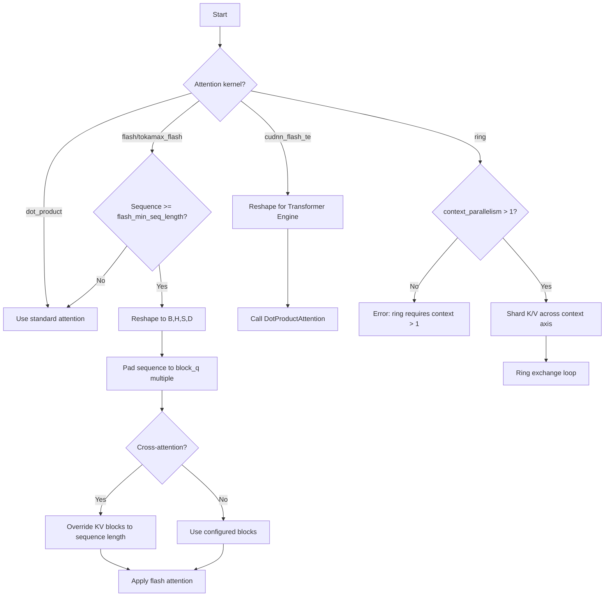

## Overview

Attention is the computational bottleneck in diffusion models. MaxDiffusion provides multiple attention implementations optimized for different hardware accelerators, sequence lengths, and memory constraints.

## Supported attention kernels

MaxDiffusion supports five attention implementations:

| Kernel | Hardware | Use case | Memory efficiency |
|--------|----------|----------|------------------|
| `dot_product` | TPU, GPU | Short sequences, debugging | Standard |
| `flash` | TPU | All sequence lengths | High |
| `tokamax_flash` | TPU | Advanced TPU optimization | Highest |
| `cudnn_flash_te` | GPU | GPU with Transformer Engine | High |
| `ring` | TPU | Extremely long sequences | Highest |

## Dot product attention

**Standard attention implementation** using matrix multiplication.

### Configuration

```yaml
attention: 'dot_product'
split_head_dim: True
float32_qk_product: True
```

### How it works

1. **Reshape**: Convert from `[B, S, H*D]` to `[B, H, S, D]`
2. **QK matmul**: Compute `attention_scores = Q @ K^T`
3. **Scale**: Multiply by `1/sqrt(head_dim)`
4. **Softmax**: Normalize attention weights
5. **Weighted sum**: Compute `output = attention_probs @ V`

### Memory-efficient variant

For long sequences, use chunked attention:

```yaml
attention: 'dot_product'
use_memory_efficient_attention: True
```

This implementation chunks the query and key/value sequences to reduce peak memory usage.

**Configuration**:

```python
# Automatic chunk size based on sequence length
query_chunk_size = sequence_length // 64  # Adaptive
key_chunk_size = 4096 * 4                # Fixed
```

### When to use

- **Short sequences** (< 4K tokens)
- **Debugging** (easier to understand than flash attention)
- **Compatibility** (works on all hardware without special kernels)

<Note>
Dot product attention has O(N²) memory complexity. For sequences > 4K, use flash attention.
</Note>

## Flash attention (TPU)

**Memory-efficient attention** using Pallas kernels optimized for TPU.

### Configuration

```yaml
attention: 'flash'
flash_min_seq_length: 0
mask_padding_tokens: True

flash_block_sizes: {
  "block_q": 512,
  "block_kv_compute": 512,
  "block_kv": 512,
  "block_q_dkv": 512,
  "block_kv_dkv": 512,
  "block_kv_dkv_compute": 512,
  "block_q_dq": 512,
  "block_kv_dq": 512,
  "use_fused_bwd_kernel": False
}
```

### Block sizes explained

<Tabs>
  <Tab title="Forward pass">
    - **block_q**: Block size for Q sequence (HBM → VMEM → VREG)
    - **block_kv**: Block size for K/V sequence (HBM → VMEM)
    - **block_kv_compute**: Sub-block for K/V computation (VMEM → VREG)

    Must satisfy: `block_kv_compute ≤ block_kv`
  </Tab>
  <Tab title="Backward pass (fused)">
    - **block_q_dkv**: Block size for Q in gradient computation
    - **block_kv_dkv**: Block size for K/V in gradient computation
    - **block_kv_dkv_compute**: Sub-block for K/V gradient computation

    Must satisfy:
    - `block_q_dkv ≤ block_q`
    - `block_kv_dkv ≤ block_kv`
    - `block_kv_dkv_compute ≤ block_kv_dkv`
  </Tab>
  <Tab title="Backward pass (unfused)">
    - **block_q_dq**: Block size for Q gradient only
    - **block_kv_dq**: Block size for K/V when computing Q gradient

    Used when `use_fused_bwd_kernel: False`
  </Tab>
</Tabs>

### Tuning block sizes

Block sizes significantly impact performance. Optimize for your hardware:

<CodeGroup>
```yaml v5p (default)
flash_block_sizes: {
  "block_q": 512,
  "block_kv_compute": 512,
  "block_kv": 512,
  "block_q_dkv": 512,
  "block_kv_dkv": 512,
  "block_kv_dkv_compute": 512,
  "block_q_dq": 512,
  "block_kv_dq": 512,
  "use_fused_bwd_kernel": False
}
```

```yaml v5p (large sequence)
flash_block_sizes: {
  "block_q": 3024,
  "block_kv_compute": 1024,
  "block_kv": 2048,
  "block_q_dkv": 1024,
  "block_kv_dkv": 3072,
  "block_kv_dkv_compute": 256,
  "block_q_dq": 1024,
  "block_kv_dq": 3072,
  "use_fused_bwd_kernel": False
}
```

```yaml v6e (Trillium)
flash_block_sizes: {
  "block_q": 3024,
  "block_kv_compute": 1024,
  "block_kv": 2048,
  "block_q_dkv": 3024,
  "block_kv_dkv": 2048,
  "block_kv_dkv_compute": 1024,
  "block_q_dq": 3024,
  "block_kv_dq": 2048,
  "use_fused_bwd_kernel": False
}
```

```yaml Flux on v6e
flash_block_sizes: {
  "block_q": 1536,
  "block_kv_compute": 1536,
  "block_kv": 1536,
  "block_q_dkv": 1536,
  "block_kv_dkv": 1536,
  "block_kv_dkv_compute": 1536,
  "block_q_dq": 1536,
  "block_kv_dq": 1536,
  "use_fused_bwd_kernel": False
}
```
</CodeGroup>

### How block sizes affect performance

**HBM bandwidth saturation**:
- Larger blocks → fewer memory transfers → better bandwidth utilization
- But: blocks must fit in VMEM (vector memory)

**Sequence length padding**:
- Sequences are padded to multiples of block sizes
- Choose block sizes that divide your sequence length evenly

**Example**:
```yaml
# Wan 720p: sequence length ≈ 183,600
block_q: 3024  # 183,600 / 3024 ≈ 61 blocks (good)

# Bad choice:
block_q: 1000  # Requires padding to 184,000 (wasteful)
```

### Minimum sequence length

Control when to use flash attention:

```yaml
flash_min_seq_length: 0  # Always use flash (recommended)
```

**Behavior**:
- If `sequence_length >= flash_min_seq_length`: Use flash attention
- Otherwise: Fall back to dot product attention

<Info>
Set `flash_min_seq_length: 0` for video models and high-resolution images. Flash attention is faster than dot product even for short sequences on modern TPUs.
</Info>

### Padding token masking

```yaml
mask_padding_tokens: True
```

**When `True`**:
- Passes segment IDs to splash attention
- Avoids attending to padding tokens
- Slightly slower but better quality

**When `False`**:
- No segment IDs passed
- Faster on VPU-bound hardware (Trillium)
- Use only when padding is minimal

### When to use

- **All sequence lengths** on TPU (v4, v5p, v6e)
- **Training and inference** for all supported models
- **Default choice** for TPU workloads

## Tokamax flash attention

**Advanced flash attention** using the Tokamax library with fused backward pass.

### Configuration

```yaml
attention: 'tokamax_flash'

flash_block_sizes: {
  "block_q": 512,
  "block_kv_compute": 512,
  "block_kv": 512,
  "block_q_dkv": 512,
  "block_kv_dkv": 512,
  "block_kv_dkv_compute": 512,
  "use_fused_bwd_kernel": True  # Required for tokamax
}
```

### Differences from standard flash

1. **Fused backward pass**: Computes dQ, dK, dV in a single kernel
2. **Better memory**: Slightly lower HBM usage during training
3. **No unfused blocks**: `block_q_dq` and `block_kv_dq` are ignored

<Note>
Tokamax flash attention requires `use_fused_bwd_kernel: True`. The unfused backward pass is not supported.
</Note>

### When to use

- **TPU training** when maximum memory efficiency is needed
- **Large models** where standard flash attention OOMs
- **Same performance** as standard flash, but slightly better memory

## cuDNN flash attention (GPU)

**GPU-optimized attention** using NVIDIA Transformer Engine.

### Installation

```bash
pip install -U "jax[cuda12]"
pip install "transformer_engine[jax]"
```

### Configuration

```yaml
attention: 'cudnn_flash_te'
hardware: 'gpu'
split_head_dim: True
```

### Running

```bash
NVTE_FUSED_ATTN=1 python src/maxdiffusion/train_sdxl.py \
  src/maxdiffusion/configs/base_xl.yml \
  attention="cudnn_flash_te" \
  hardware=gpu
```

<Info>
The `NVTE_FUSED_ATTN=1` environment variable enables fused attention in Transformer Engine.
</Info>

### GPU-specific parallelism

For Wan models on GPU:

```yaml
attention: "cudnn_flash_te"
ici_fsdp_batch_parallelism: 2  # Batch parallelism (no fractional)
ici_fsdp_parallelism: 2         # Sequence parallelism
```

**Constraints**:
- Sequence length must be divisible by `ici_fsdp_parallelism` (no padding)
- Fractional batch sizes not supported with batch parallelism

### When to use

- **GPU training and inference** (H100, A100)
- **All supported models** on GPU
- **Best GPU performance** with Transformer Engine

## Ring attention

**Distributed attention** for extremely long sequences across multiple devices.

### Configuration

```yaml
attention: 'ring'
ici_context_parallelism: 4  # Must be > 1

flash_block_sizes: {
  "use_fused_bwd_kernel": True  # Required
}
```

### How it works

1. **Shard K/V**: Split key and value across devices on context axis
2. **Local attention**: Each device computes attention with its local K/V shard
3. **Ring exchange**: Rotate K/V shards between devices
4. **Aggregate**: Combine partial attention outputs using LSE (log-sum-exp)

**Visualization**:
```
Device 0: Q @ K0/V0 → output0, lse0
Device 1: Q @ K1/V1 → output1, lse1
...

# Ring: rotate K/V
Device 0: Q @ K1/V1 → output0', lse0'
...

# Combine using log-sum-exp
final_output = stable_combine([output0, output0', ...], [lse0, lse0', ...])
```

### Requirements

- `ici_context_parallelism > 1`
- `use_fused_bwd_kernel: True`
- Sequence must be shardable across context axis

### When to use

- **Extremely long sequences** (> 1M tokens)
- **Video models** with many frames
- **Memory-constrained** training

<Note>
Ring attention adds communication overhead. Only use when sequences don't fit with standard flash attention.
</Note>

## Attention flowchart

MaxDiffusion automatically adjusts block sizes following this flowchart:



### Automatic adjustments

MaxDiffusion logs modifications to block sizes:

```
Modified block sizes for cross-attention:
  block_kv: 512 → 256 (text sequence length)
  block_kv_compute: 512 → 256
```

## Performance comparison

### TPU (v5p-8) - Wan2.1 training

| Attention | Step time | Memory | TFLOP/s/device |
|-----------|-----------|--------|----------------|
| dot_product | 142s | OOM | - |
| flash | 36s | 95% | 135.9 |
| tokamax_flash | 36s | 93% | 135.9 |

### GPU (H100) - SDXL training

| Attention | Step time | Memory |
|-----------|-----------|--------|
| dot_product | 3.2s | 78 GB |
| cudnn_flash_te | 1.8s | 62 GB |

## Debugging attention

### Enable attention logging

```yaml
enable_jax_named_scopes: True
```

This adds named scopes around attention operations for profiler visibility.

### Check actual shapes

Add prints in `attention_flax.py:524`:

```python
print(f"Query shape: {query.shape}")
print(f"Key shape: {key.shape}")
print(f"Value shape: {value.shape}")
```

### Profile attention

```yaml
enable_profiler: True
profiler_steps: 3
skip_first_n_steps_for_profiler: 5
```

View traces in TensorBoard to see attention kernel performance.

## Common issues

### Sequence not divisible by block size

**Symptom**: Excessive padding, high memory usage

**Solution**: Choose block sizes that divide sequence length:

```python
# Sequence length = 183,600
block_q: 3024  # 183,600 / 3024 = 60.7 → padded to 61 blocks
block_q: 2048  # 183,600 / 2048 = 89.6 → worse padding
```

### Out of memory with flash attention

**Symptom**: OOM during attention forward/backward

**Solutions**:
1. Reduce block sizes (less VMEM usage)
2. Enable gradient checkpointing: `remat_policy: "FULL"`
3. Use tokamax flash: `attention: "tokamax_flash"`
4. Use ring attention: `attention: "ring"`

### cuDNN flash not working

**Symptom**: Error about missing Transformer Engine

**Solution**:
```bash
pip install "transformer_engine[jax]"
export NVTE_FUSED_ATTN=1
```

### Quality degradation with mask_padding_tokens=False

**Symptom**: Blurry outputs, attention to padding

**Solution**: Set `mask_padding_tokens: True` if padding is significant (> 10% of sequence).

## Best practices

1. **Use flash attention by default** on TPU
2. **Tune block sizes** for your sequence length
3. **Set flash_min_seq_length: 0** for video models
4. **Enable mask_padding_tokens** for variable-length sequences
5. **Use cudnn_flash_te on GPU** with Transformer Engine
6. **Profile attention kernels** to verify performance

## Next steps

- Configure [parallelism strategies](/concepts/parallelism)
- Explore [supported models](/concepts/models)
- Understand MaxDiffusion's [architecture](/concepts/architecture)